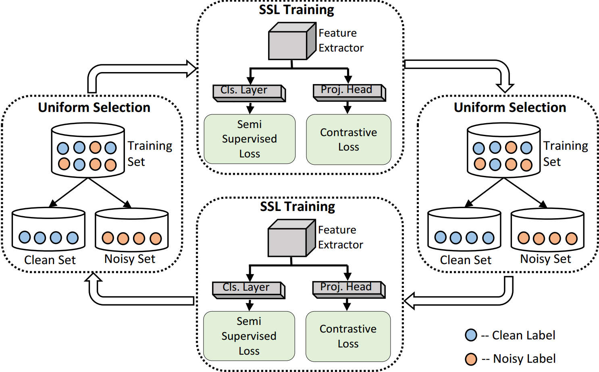
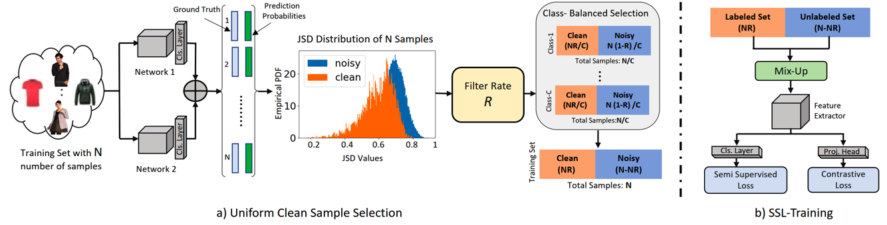

# UNICON-Noisy-Label
Official Implementation of the CVPR 2022 paper "UNICON: Combating Label Noise Through Uniform Selection and Contrastive Learning"
https://arxiv.org/pdf/2203.14542.pdf

<!--  -->

# Example Run
After creating a virtual environment, run

	pip install -r requirements.txt

Example run (CIFAR10 with 50% symmetric noise) 

	python Train_cifar.py --dataset cifar10 --num_class 10 --data_path ./data/cifar10 --noise_mode 'sym' --r 0.5 

Example run (CIFAR100 with 90% symmetric noise) 

	python Train_cifar.py --dataset cifar100 --num_class 100 --data_path ./data/cifar100 --noise_mode 'sym' --r 0.9 

This will throw an error as downloaded files will not be in proper folder. That is why they are needed to be manually moved to the "data_path".

Example Run (TinyImageNet with 50% symmetric noise)

	python Train_TinyImageNet.py --ratio 0.5

Example run (Clothing1M)
	
	python Train_clothing1M.py --batch_size 32 --num_epochs 200   

Example run (Webvision)
	
	python Train_webvision.py 

# Dataset
For datasets other than CIFAR10 and CIFAR100, you need to download them from their corresponsing website.

# Reference 
If you have any questions, do not hesitate to contact at nazmul.karim18@knights.ucf.edu

Also, if you find our work useful please cite: 

	@InProceedings{Karim_2022_CVPR,
	    author    = {Karim, Nazmul and Rizve, Mamshad Nayeem and Rahnavard, Nazanin and Mian, Ajmal and Shah, Mubarak},
	    title     = {UniCon: Combating Label Noise Through Uniform Selection and Contrastive Learning},
	    booktitle = {Proceedings of the IEEE/CVF Conference on Computer Vision and Pattern Recognition (CVPR)},
	    month     = {June},
	    year      = {2022},
	    pages     = {9676-9686}
	}
 
